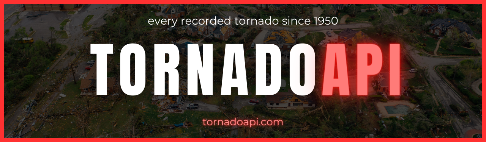
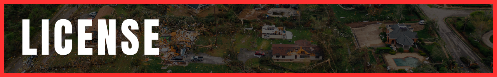
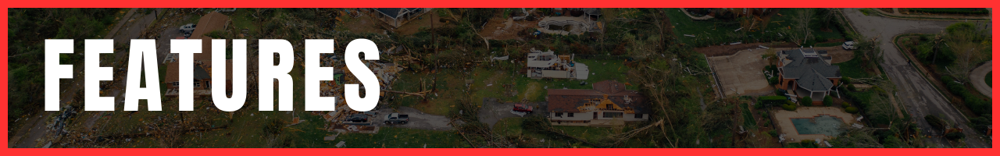
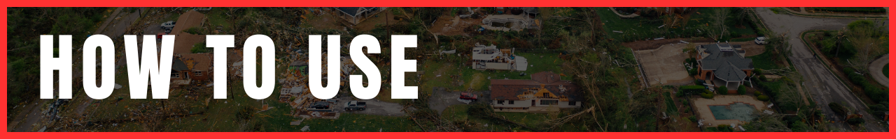
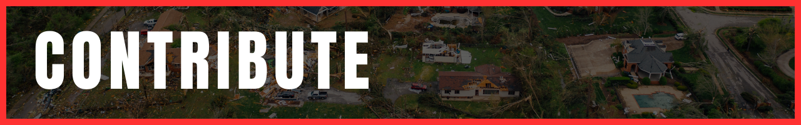
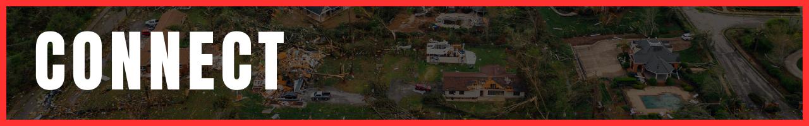

<div id='intro' align='center'>
  
</div>

<div align='right'>
  <div>
    <a href='#intro'>intro</a>&nbsp; |&nbsp;
    <a href='#license'>license</a>&nbsp; |&nbsp;
    <a href='#features'>features</a>&nbsp; |&nbsp;
    <a href='#how-to-use'>how to use</a>&nbsp; |&nbsp;
    <a href='#contribute'>contribute</a>&nbsp; |&nbsp;
    <a href='#connect'>connect</a>
  </div>
  <br/>
</div>

>

Version 1 of [tornadoapi.com](tornadoapi.com) will provide RESTful access to statistical data for every tornado recorded since 1950. The Storm Prediction Center's [Severe Weather Database Files](https://www.spc.noaa.gov/wcm/#data) serve as the foundation of the API.

The goal of this project is to make historical tornado data more accessible to severe wx fanatics and meteorology professionals alike. TornadoAPI.com will also serve as the visualization data source for my other project, [tornadowarned.com](www.tornadowarned.com).

Version 2 of the API will provide GraphQL access to the same set of data provided in the REST version.

<br>

<div id='license' align='center'>
  
</div>

<div align='right'>
  <div>
    <a href='#intro'>intro</a>&nbsp; |&nbsp;
    <a href='#license'>license</a>&nbsp; |&nbsp;
    <a href='#features'>features</a>&nbsp; |&nbsp;
    <a href='#how-to-use'>how to use</a>&nbsp; |&nbsp;
    <a href='#contribute'>contribute</a>&nbsp; |&nbsp;
    <a href='#connect'>connect</a>
  </div>
  <br/>
</div>

### The MIT License (MIT)

Copyright © 2023 | Ephraim Smith

Permission is hereby granted, free of charge, to any person obtaining a copy of this software and associated documentation files (the “Software”), to deal in the Software without restriction, including without limitation the rights to use, copy, modify, merge, publish, distribute, sublicense, and/or sell copies of the Software, and to permit persons to whom the Software is furnished to do so, subject to the following conditions:

The above copyright notice and this permission notice shall be included in all copies or substantial portions of the Software.

THE SOFTWARE IS PROVIDED “AS IS”, WITHOUT WARRANTY OF ANY KIND, EXPRESS OR IMPLIED, INCLUDING BUT NOT LIMITED TO THE WARRANTIES OF MERCHANTABILITY, FITNESS FOR A PARTICULAR PURPOSE AND NONINFRINGEMENT. IN NO EVENT SHALL THE AUTHORS OR COPYRIGHT HOLDERS BE LIABLE FOR ANY CLAIM, DAMAGES OR OTHER LIABILITY, WHETHER IN AN ACTION OF CONTRACT, TORT OR OTHERWISE, ARISING FROM, OUT OF OR IN CONNECTION WITH THE SOFTWARE OR THE USE OR OTHER DEALINGS IN THE SOFTWARE.

<div id='features' align='center'>
  
</div>

<div align='right'>
  <div>
    <a href='#intro'>intro</a>&nbsp; |&nbsp;
    <a href='#license'>license</a>&nbsp; |&nbsp;
    <a href='#features'>features</a>&nbsp; |&nbsp;
    <a href='#how-to-use'>how to use</a>&nbsp; |&nbsp;
    <a href='#contribute'>contribute</a>&nbsp; |&nbsp;
    <a href='#connect'>connect</a>
  </div>
  <br/>
</div>

### **RESTful Access to Historical U.S. Tornado Data**

- [x] Severe Weather Tornado Data
- [ ] Severe Weather Hail Data
- [ ] Severe Weather Wind Data

### **API Documentation**

- [ ] comprehensive README.md
- [ ] REST endpoints
- [ ] GraphQL schemas

### **Coming Soon: GraphQL Access to Historical U.S. Tornado Data**

<div id='how-to-use' align='center'>
  
</div>

<div align='right'>
  <div>
    <a href='#intro'>intro</a>&nbsp; |&nbsp;
    <a href='#license'>license</a>&nbsp; |&nbsp;
    <a href='#features'>features</a>&nbsp; |&nbsp;
    <a href='#how-to-use'>how to use</a>&nbsp; |&nbsp;
    <a href='#contribute'>contribute</a>&nbsp; |&nbsp;
    <a href='#connect'>connect</a>
  </div>
  <br/>
</div>

### **Clone The Repo**

```shellscript
cd <parent-folder-path/>
```

```shellscript
git clone https://github.com/ephcoding/tornado-api.git
```

### **Install Project Dependencies**

```shellscript
cd tornado-api
```

```shellscript
npm install

OR

yarn
```

### **Run Your New Project**

```shellscript
npm run dev

OR

yarn  dev
```

_Every project is set up different. Give users the rundown on the various working parts of your project._

### **Project Structure**

```shellscript

tornado-api/....................root directory
  config/.......................database & deployment configs
  constants/....................manage project-wide variables from one folder
  controllers/..................endpoint-handling logic
  data/.........................seed data files
  images/.......................graphic assets for README.md
  models/.......................database object definitions
  routes/.......................request routing
  utils/........................util functions for converting .csv files to .json files
  .gitignore....................don't expose those .env keys!
  package.json..................project dependencies
  README.md.....................you are here [X]
  yarn.lock.....................dependency lock file
```

### **Dependencies**

#### **_Production_**

[`csvtojson`]() | asdf

[`dotenv`]() | asdf

[`express`]() | asdf

[`mongodb`]() | asdf

[`mongoose`]() | asdf

[`morgan`]() | asdf

#### **_Development_**

[`nodemon`]() | asdf

### **Scripts**

`"start"` | sets `NODE_ENV` to "production" and starts server

`"dev"` | starts the development server using `nodemon` which restarts the server when changes are saved

<br>

<div id='contribute' align='center'>
  
</div>

<div align='right'>
  <div>
    <a href='#intro'>intro</a>&nbsp; |&nbsp;
    <a href='#license'>license</a>&nbsp; |&nbsp;
    <a href='#features'>features</a>&nbsp; |&nbsp;
    <a href='#how-to-use'>how to use</a>&nbsp; |&nbsp;
    <a href='#contribute'>contribute</a>&nbsp; |&nbsp;
    <a href='#connect'>connect</a>
  </div>
  <br/>
</div>

### **_Issues:_**

> issue submission process coming soon

### **_Pull Requests:_**

> PR submission process coming soon

<div id='connect' align='center'>
  
</div>

<div align='right'>
  <div>
    <a href='#intro'>intro</a>&nbsp; |&nbsp;
    <a href='#license'>license</a>&nbsp; |&nbsp;
    <a href='#features'>features</a>&nbsp; |&nbsp;
    <a href='#how-to-use'>how to use</a>&nbsp; |&nbsp;
    <a href='#contribute'>contribute</a>&nbsp; |&nbsp;
    <a href='#connect'>connect</a>
  </div>
  <br/>
</div>

 <div align='center'>
    <a href='https://github.com/ephcoding' alt='github icon'>
      
    </a>
    &nbsp;
    &nbsp;
    <a href='https://twitter.com/_ephraimsmith' alt='twitter icon'>
      
    </a>
    &nbsp;
    &nbsp;
    <a href='https://linkedin.com/in/ephraimjsmith' alt='linkedin icon'>
      
    </a>
    &nbsp;
    &nbsp;
    <a href='mailto:ephraimjsmith@gmail.com' alt='email icon'>
      
    </a>
  </div>
